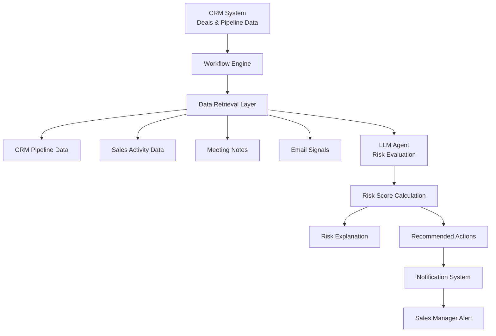

# Sales Risk Monitor Agent – Architecture

```mermaid
flowchart TD

A[CRM System<br>Deals & Pipeline Data] --> B[Workflow Engine]

B --> C[Data Retrieval Layer]

C --> D1[CRM Pipeline Data]
C --> D2[Sales Activity Data]
C --> D3[Meeting Notes]
C --> D4[Email Signals]

C --> E[LLM Agent<br>Risk Evaluation]

E --> F[Risk Score Calculation]

F --> G[Risk Explanation]

F --> H[Recommended Actions]

H --> I[Notification System]

I --> J[Sales Manager Alert]
```
